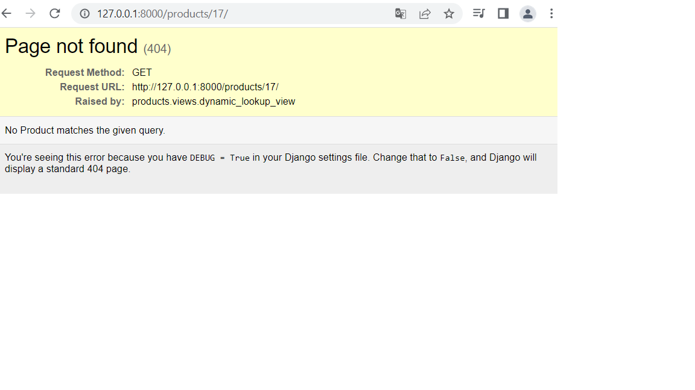

* product_create.html &nbsp;
    action means you can completelly send your url to a different place

    form action='/search/' method='POST'&nbsp;
    
    
    google search example
    action='http://www.google.com/search method='GET'>
    type='text' name="q" placeholder="your search"&nbsp;&nbsp;

    request from url: http://127.0.0.1:8000/create/?title=this%20is%20a%20title
    
&nbsp;&nbsp;
https://docs.djangoproject.com/en/4.0/ref/forms/fields/
* product_form.html&nbsp;
    form.as_p -> p means p tag see below
    &nbsp;
    widget=forms.Textarea: change text p form to Text box
&nbsp;&nbsp;
https://docs.djangoproject.com/en/4.0/ref/forms/widgets/
&nbsp;&nbsp;   

* 404 example
from django.shortcuts import render, get_object_or_404

obj = get_object_or_404(Product, id=id)
context = {
    "object": obj
}
&nbsp;&nbsp;
from django.http import Http404
try:
    obj = Product.objects.get(id=id)
except Product.DoesNotExist:
    raise Http404

    
    