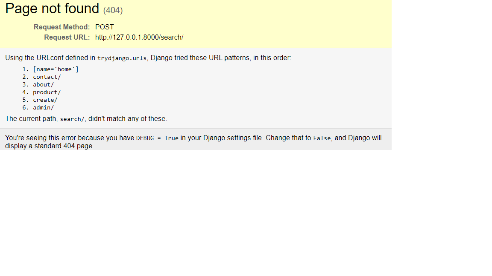

* product_create.html &nbsp;
    action means you can completelly send your url to a different place

    form action='/search/' method='POST'&nbsp;
    
    
    google search example
    action='http://www.google.com/search method='GET'>
    type='text' name="q" placeholder="your search"&nbsp;&nbsp;

    request from url: http://127.0.0.1:8000/create/?title=this%20is%20a%20title
    

* product_form.html&nbsp;
    form.as_p -> p means p tag see below
    
    
    